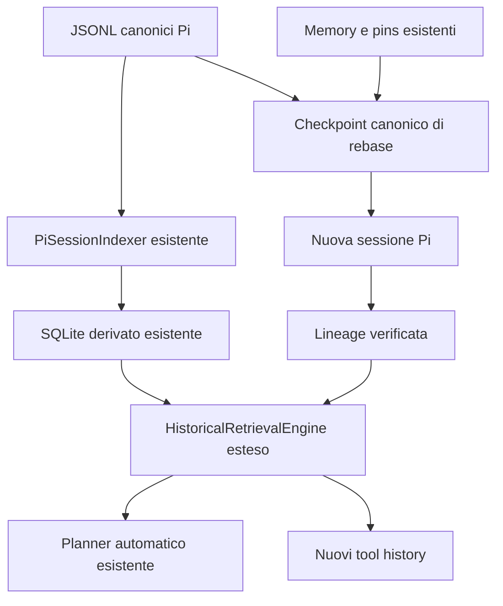
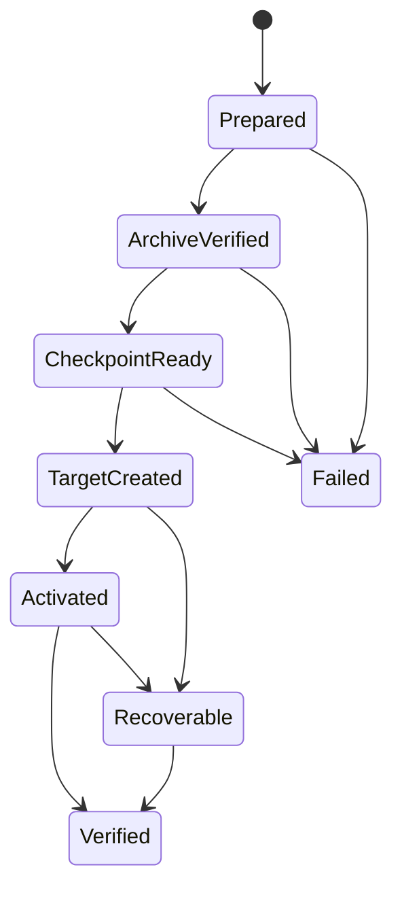

# DS4 Context Engine piano di integrazione di History Recall e Session Rebase

Versione del piano: 2.0 — 5 ottobre 2026
Destinatario: Diego Monaco
Pacchetto interessato: `ds4-context-engine`
Obiettivo: rendere consultabile lo storico escluso dal contesto e mantenere contenute le dimensioni della sessione operativa.

## 1. Risultato atteso e perimetro

Integrare in DS4 tre livelli coordinati: contesto attivo, memoria durevole e archivio storico interrogabile. Il modello potrà recuperare messaggi, errori e decisioni anteriori alle compattazioni mediante tool dedicati. Un comando di rebase trasferirà il lavoro in una sessione nuova, conservando un checkpoint e il collegamento allo storico.

Il lavoro è diviso in due rilasci principali:

1. **History Recall:** acquisizione incrementale, indice locale, ricerca e lettura delle fonti, isolamento di progetto e ramo.
2. **Session Rebase:** checkpoint, nuova sessione, continuità del recall, verifica e recupero dopo un'interruzione.

Retrieval automatico e ricerca semantica già presenti vengono riutilizzati; eventuali miglioramenti vengono dopo la prima versione dei nuovi tool. Jev può validare dati strutturati se già integrato nel progetto, ma non è una dipendenza necessaria del sistema storico.

Il piano è stato adattato ai sorgenti pubblici di [Alucard24/ds4-context-engine](https://github.com/Alucard24/ds4-context-engine), letti dal checkout del commit `419d50b91c1b82b20b652ac9c0c1cfd0559f68d8` (main, versione del manifest `0.4.13`). La pagina del catalogo Pi riportava `0.4.12`: per questa analisi prevalgono manifest e codice del commit, senza presumere quale versione sia installata sul tuo PC.

**Il punto decisivo è che DS4 possiede già il retrieval storico automatico.** Non bisogna costruire un altro History Engine da zero. L'integrazione deve esporre ricerca e lettura al modello, estendere la provenienza alle sessioni collegate dal rebase e aggiungere il ciclo di vita della sessione. La premessa della discussione secondo cui DS4 non potesse recuperare dati precedenti alla compaction era quindi troppo generale.

La revisione è statica: non sono stati eseguiti test del repository o chiamate a provider. Le modifiche proposte sono distinte dalle funzionalità osservate nei sorgenti.

## 2. Base tecnica verificata e correzioni rispetto alla discussione

La documentazione Pi consultata descrive sessioni JSONL con entry collegate da `id` e `parentId`; il modello riceve una proiezione della sessione, non tutto il file. Un riferimento alla sessione madre esiste anche per sessioni derivate. [S1]

La compaction genera un riepilogo e mantiene una porzione recente tramite `firstKeptEntryId`. Le entry escluse restano memorizzate. Il processo può usare il riepilogo precedente; il suo hook espone anche le informazioni necessarie per gestire turni spezzati. [S2]

Le estensioni possono registrare tool e comandi, osservare `session_before_compact`, modificare il contesto e usare storage esterno. `getBranch()` permette la ricostruzione dello stato sul ramo attivo. La sostituzione della sessione richiede il command context e invalida il vecchio contesto. [S3]

Precisazioni progettuali:

- **Fuori dal contesto non significa tecnicamente irraggiungibile.** Un agente con accesso ai file potrebbe leggere il JSONL, se conosce il percorso e dispone degli strumenti. Qui si costruisce un accesso esplicito, selettivo e affidabile.
- **Recall non garantisce memoria perfetta.** Un'informazione può non essere acquisita, non essere trovata o essere interpretata male. Le risposte devono dichiarare copertura, provenienza e troncamenti.
- **Rebase riduce la sessione attiva, non automaticamente lo spazio totale.** Archivio e indice continuano a crescere; serve una politica distinta di conservazione.
- **SQLite con testo e FTS non rimane necessariamente piccolo.** Misurare dati, indice e payload separatamente.
- **Un offset in un unico `.gz` non dà accesso casuale economico.** Usare segmenti compressi indipendenti e bounded, oppure payload per entry.
- **I punteggi non sono probabilità.** Una soglia universale `0.80` non ha significato per una combinazione arbitraria di BM25 e bonus.
- **Il ramo non è un semplice campo immutabile per ogni entry.** Gli antenati sono condivisi: la visibilità dipende dalla discendenza della foglia attiva.

Le sezioni seguenti descrivono scelte DS4 proposte, non funzionalità già presenti in Pi o nel pacchetto.

## 3. Mappa del codice esistente e del lavoro necessario

Baseline letta: Node `>=22.19.0`, ESM, TypeScript `5.9.3`, Vitest `4.1.9`, Pi e pi-ai `0.84.3`, core coordinato `0.4.13`, SQLite built-in `node:sqlite`, migrazioni fino alla 16. Questi dati provengono dal manifest e dai sorgenti, non dalla documentazione Pi latest.

| File o modulo reale | Già presente | Modifica prevista |
|---|---|---|
| `src/extension/index.ts` | Bootstrap, tool persistence/artifact, lifecycle | Registrare i nuovi tool di history |
| `src/extension/runtime.ts` | `retrieveHistory`, `syncSessionIndex`, `transformContext`, `rebuildIndex` | Port pubblico per recall/read; lifecycle rebase senza duplicare runtime |
| `src/pi-adapter/session-indexer.ts` | `PiSessionIndexer.sync`, import incrementale, hash e rebuild | Riutilizzo; aggiungere lettura bounded e copertura dove mancano |
| `src/pi-adapter/session-jsonl.ts` | Lettura e checkpoint JSONL | Accesso paginato alle fonti e verifica dei locator |
| `src/pi-adapter/indexed-entry.ts` | Chiave sessione/entry; testo anche per compaction e branch summary | Classificazione dei tipi ricercabili dai nuovi tool |
| `packages/core/src/retrieval/retrieval-engine.ts` | `HistoricalRetrievalEngine`, exact/FTS, semantica opzionale e ranking | Supporto query esplicita, lineage e riferimenti compositi |
| `packages/core/src/retrieval/task-descriptor.ts` | Estrazione identificatori e termini, filtro parole generiche | Riutilizzare; testare query brevi date dal tool |
| `packages/core/src/persistence/repositories/session-index-repository.ts` | Entry, FTS, checkpoint e query per sessione | Scope prima del LIMIT; locator canonici e ricerche multi-sessione |
| `src/pi-adapter/project-memory-sync.ts` | `ProjectMemorySynchronizer`, sorgenti del progetto e replay | Riutilizzare discovery/trust; non confonderlo con history lineage |
| `packages/core/src/memory/memory-manager.ts` e `src/pi-adapter/memory-adapter.ts` | Memory/pins e replay delle mutazioni | Carry-forward controllato al rebase, mantenendo le fonti |
| `src/extension/context-persistence-tool.ts` | Tool per pins/memory, revisioni e policy | Conservare il contratto; il nuovo recall non è una mutazione memory |
| `src/extension/context-persistence-egress.ts` e core privacy | Protezioni sull'output verso provider | Applicare policy anche a history content/details |
| `packages/core/src/artifacts/` | Oggetti content-addressed e letture limitate | Riutilizzare per grandi tool output, senza nuovo blob store MVP |
| `packages/core/src/compaction/` e adapter compaction | Summary graph, validazione e commit lifecycle | Usare come fonte checkpoint; preservare i controlli esistenti |
| `packages/core/src/persistence/write-coordinator.ts` e lease | Coordinamento scritture e client attivi | Integrare lock rebase; non introdurre un secondo sistema incompatibile |
| `packages/core/src/persistence/storage-maintenance.ts` | Manutenzione storage derivato | Distinguere manutenzione DB da rebase della sessione Pi |
| `packages/core/src/adapter/runtime-adapter.ts` | Contratto portabile | Nuova capacità rebase opzionale; reference adapter può dichiararla non disponibile |
| `src/extension/commands.ts` | Namespace `/context` | Aggiungere sottocomandi history e rebase |

### Gap osservati che orientano il piano

1. `retrieveHistory()` usa la sessione corrente e la query ricavata dal messaggio utente; non espone un tool generale di interrogazione storica.
2. `RetrieveHistoryInput` ha un singolo `sessionId`; `RetrievedEvidence` identifica l'entry senza una provenienza multi-sessione completa. Per il rebase occorre estendere questi contratti senza collisioni.
3. Il retrieval esclude entry già nel contesto e filtra `message`/`custom_message`. Il testo delle compaction è indicizzato, ma viene escluso da questo filtro: il tool può offrire un filtro esplicito per i summary.
4. Le query del repository applicano LIMIT prima che il retrieval filtri gli antenati del ramo. Molti hit di rami alternativi possono esaurire la finestra candidati. Va aggiunto un test specifico e spostato il filtro prima del limite o introdotta una paginazione completa e bounded.
5. `PiSessionIndexer` ha già cursor, fingerprint e gestione del tail incompleto. Il rebuild legge e materializza l'insieme dei record: lo streaming bounded è un miglioramento da misurare, non un modulo da riscrivere alla cieca.
6. `context_artifact_search` cerca in un artifact noto; `context_persistence` opera su pins/memory. Nessuno dei due equivale a un recall generale del transcript.
7. Nei percorsi `src`, core e test esaminati non sono emerse chiamate a `newSession`/`switchSession` né un coordinatore rebase. Questa parte è nuova.

## 4. Architettura incrementale proposta

Conservare la separazione esistente: policy e contratti nel core, accesso Pi nell'adapter, comandi/tool nell'estensione. Conservare il retrieval automatico e i suoi default; non aggiungere un secondo auto-injector.



File nuovi proposti:

- `src/extension/context-history-tool.ts` e `context-history-contract.ts`: registrazione tool read-only e schema bounded.
- `packages/core/src/retrieval/history-query.ts`: contratto query unificato per richiesta esplicita e retrieval automatico.
- `packages/core/src/retrieval/history-scope.ts`: risoluzione scope e lineage.
- `src/pi-adapter/history-source-reader.ts`: accesso canonico verificato alla fonte.
- `packages/core/src/rebase/checkpoint.ts`, `rebase-types.ts`: strutture portabili e validazione.
- `src/pi-adapter/session-rebase.ts`: cambio sessione tramite API Pi 0.84.3 verificate.
- `packages/core/src/persistence/repositories/rebase-repository.ts`: proiezione ricostruibile dei record canonici del rebase.

Preferire piccoli servizi estratti al crescere del runtime. Il core non importa SDK Pi; il reference adapter continua a compilare e i test di confine restano attivi.

## 5. Invarianti da mantenere

1. Un'importazione ripetuta delle stesse entry non duplica risultati o stato.
2. Le chiavi di provenienza comprendono almeno progetto, sessione ed entry.
3. Il recall predefinito include solo il ramo corrente e la sua lineage esplicita.
4. Un altro progetto non compare mai come fallback di una ricerca vuota.
5. DS4 non tronca o riscrive il JSONL attivo di Pi.
6. Il rebase non procede con archivio incompleto, payload mancanti o tool ancora in esecuzione.
7. Un errore del recall non interrompe la conversazione ordinaria; un errore di integrità impedisce il rebase.
8. Ogni dato recuperato conserva fonte, timestamp, tipo e limitazioni.
9. Un riepilogo o una proposta dell'assistente non diventa automaticamente una decisione confermata.
10. Il rebase non modifica file di progetto, working tree o Git branch.
11. Nessun doppio inserimento nel contesto di checkpoint, memoria e stessi frammenti recenti.
12. Le sessioni senza un file persistente hanno capacità ridotte dichiarate; non simulare un archivio completo.

## 6. Identità, rami e sessioni simultanee

### Identità del progetto

Riutilizzare l’identità basata sul percorso canonico già utilizzata da DS4 e la risoluzione `storage.scope` esistente. Non introdurre UUID di progetto e migrazione identità nel MVP. Percorsi rinominati, worktree e copie del repository restano scope distinti salvo relink esplicito.

Proposta iniziale: ogni worktree ha uno scope distinto; la condivisione di memory tra worktree è una configurazione esplicita. Non usare il solo remote Git per unificare cartelle diverse.

### Identità del ramo

Lo scope corrente è l'insieme degli antenati della foglia selezionata, non tutte le entry con timestamp precedente. Un'entry comune prima della biforcazione è visibile su entrambi i rami; un'entry sul ramo fratello è esclusa.

Il rebase registra un legame preciso:

```ts
interface LineageLink {
  projectId: string;
  childSessionId: string;
  sourceSessionId: string;
  sourceLeafEntryId: string;
  checkpointId: string;
}
```

La ricerca dalla nuova sessione percorre gli antenati della foglia corrente e poi gli antenati di `sourceLeafEntryId` nella sessione sorgente. Ripete il procedimento per rebase precedenti, con rilevazione dei cicli e limite di profondità diagnostico.

Distinguere sempre il ramo della conversazione dal Git branch. Registrare commit e worktree come provenienza del codice, senza usarli come sostituti della topologia conversazionale.

### Concorrenza

Più processi possono scrivere nello stesso archivio di progetto. Usare transazioni brevi, chiavi univoche, retry limitati e un lock esclusivo di rebase per sessione sorgente. Un mutex JavaScript protegge soltanto un processo e non basta.

Usare SQLite su disco locale. Per cartelle di rete o cartelle sincronizzate, scegliere uno storage locale separato; non trattare la sincronizzazione dei file del DB come un protocollo multi-host. Il design deve includere `busy_timeout`, una coda di scritture per processo e una strategia di checkpoint WAL, da validare con il driver scelto.

## 7. Storage canonico e schema da estendere

**Invariante già presente da preservare: SQLite e artifacts sono ricostruibili.** Il primo rilascio non crea un secondo archivio canonico e non duplica tutte le sessioni in nuovi segmenti. I JSONL Pi restano le fonti. Non scegliere un altro driver: `node:sqlite`, write coordinator e migrazioni esistono già.

Riutilizzare `sessions`, `entries`, `entries_fts`, `entries_fts_keys` e `session_index_state`. Preservare la chiave esistente `sessionId:entryId`. A livello API includere anche l’identità del progetto verificata dal runtime.

Proposta di migrazione successiva alla 16, da rinumerare se nel frattempo il repository avanza:

| Aggiunta derivata | Funzione | Fonte per rebuild |
|---|---|---|
| `entry_source_locations` | Offset/range e hash per letture puntuali | JSONL originale |
| `rebase_checkpoints` | Indice di checkpoint e copertura | Custom entry versionate Pi |
| `session_lineage` | Target → source session/source leaf | Record canonici nelle sessioni collegate |
| `rebase_operations` | Stato procedura e target associato | Journal canonico e marker del target |
| Indice o query degli antenati | Scope applicato prima del LIMIT | Parent ID delle entry |

Non riscrivere le migrazioni 1–16. Aggiornare test golden/checksum e allowlist dello storage solo con una nuova migrazione. Il DB più nuovo del codice deve continuare a essere rifiutato senza downgrade implicito.

### Canonicalità del rebase

Definire custom entry versionate, per esempio `ds4-rebase-checkpoint-v1` e `ds4-rebase-link-v1`, contenenti origine, foglia, operazione, checksum e stato trasferito. La sorgente conserva il checkpoint preparato; il target conserva il collegamento e il marker della stessa operazione. Le proiezioni SQLite possono essere eliminate e ricostruite.

Il checkpoint deve contenere o referenziare in modo verificabile tutti gli antenati necessari al suo stato. Non rendere un file JSON esterno o una riga SQL l’unica copia di un pin trasferito. Per crash prima del marker target prevedere staging filesystem atomico con journal recuperabile; rimuoverlo solo dopo riconciliazione dei record canonici.

La compressione offline di JSONL chiusi è una fase successiva e richiede un ADR: il reader Pi corrente e la discovery DS4 potrebbero non aprire `.gz`. Finché non esiste un archive resolver compatibile, mantenere la sorgente nel suo percorso. Il nuovo target è piccolo anche senza comprimere o cancellare il predecessore.

## 8. Acquisizione e lifecycle da riutilizzare

`PiSessionIndexer.sync()` gestisce già import iniziale, incrementi, header hash, checkpoint, file modificato, truncate e sessioni non persistite. `registerDs4ContextEngine()` collega già `session_start`, `context`, `agent_settled`, compaction, tree e shutdown. Integrare questi percorsi senza duplicare watcher o sincronizzazioni complete.

Per i nuovi tool:

1. Verificare runtime, progetto trusted e disponibilità dello storage.
2. Eseguire il catch-up tramite `syncSessionIndex()` esistente.
3. Fissare sessione/foglia e revisioni per la durata della query.
4. Cercare nella proiezione consentita.
5. Leggere la fonte canonica solo se richiesto da `history_read`, verificando hash e range.
6. Applicare policy di egress e budget al testo restituito.

Un cursor SQL non basta come prova di copertura: riportare malformed lines, source missing e limiti d’importazione. Se una sorgente cambia tra indice e read, invalidare il riferimento o reindicizzare; non restituire contenuto diverso sotto lo stesso hash.

La normale compaction continua a funzionare anche se il nuovo tool è disabilitato. Riutilizzare gli hook e il coordinator attuali: un tentativo diventa confermato solo dopo la persistenza della compaction. Il rebase richiede invece catch-up completo e fonti verificabili.

Ottimizzazioni future: lettura stream a batch per rebuild grandi e recupero del solo suffisso quando sicuro. Misurare prima il comportamento di `readJsonlRecords`; non sostituire i controlli di append-only validation per guadagnare velocità.

## 9. Normalizzazione e ricerca

### Contenuti

Indicizzare messaggi utente, testo visibile dell'assistente, chiamate tool e risultati testuali, riepiloghi, comandi, percorsi ed errori. Conservare i blocchi strutturati disponibili e i collegamenti call/result. Non inventare output non persistiti da Pi.

Escludere dal recall ordinario reasoning interno, credenziali rilevate e binari. Registrare allegati mediante metadati e disponibilità; OCR o trascrizione sono capacità successive. Se la redazione rimuove un segreto, dichiarare che l'archivio DS4 è redatto e non è una copia byte per byte del JSONL originale.

### Chunking

Proposta iniziale: 600–1.200 token stimati per chunk, overlap limitato a 80–150 token per output lunghi. Per messaggi brevi usare un solo chunk. Mantenere nome tool, call ID e riferimento al risultato; dividere i log per righe e il codice rispettando per quanto possibile i blocchi.

I limiti sono parametri da misurare. Conservare sempre intervallo e riferimento alla fonte più ampia. Escludere dalla nuova indicizzazione il testo duplicato dei risultati prodotti dai tool DS4, oppure memorizzare solo i loro riferimenti: il recall non deve amplificare se stesso.

### Pipeline lessicale da estendere

1. Validare query, filtri e limiti.
2. Risolvere lo scope autorizzato e gli antenati.
3. Cercare identificatori esatti e frasi, preservando anche la grafia originale.
4. Eseguire FTS con query parametrizzata e sintassi controllata.
5. Preservare il ranking corrente e la sua fusione RRF semantica; non cambiarli insieme al tool senza una regressione misurabile.
6. Deduplicare overlap e risultati della stessa entry; diversificare per fonte.
7. Restituire estratti limitati con motivi del match e riferimenti leggibili.

Applicare i filtri di visibilità prima del top K: filtrare dopo potrebbe scartare tutti i candidati e nascondere risultati validi. Il segno e la scala del BM25 del driver vanno verificati; non sommare punteggi eterogenei alla cieca.

Esempi di fixture: `GetNewID`, `f_getcolumnmask`, `firstKeptEntryId`, `MSC_tri_OrderForm_CreateFormNofromStockClass`, percorsi Windows, italiano e inglese nella stessa sessione.

La ricerca semantica opzionale esiste già: riutilizzare `SemanticEmbeddingIndex`, configurazione e fallback attuali. Non implementare un secondo provider o cambiare default in questo intervento. Verificare che l’estensione multi-sessione mantenga hash e scope corretti anche per gli embedding.

## 10. Contratti interni e tool del modello

Il seguente TypeScript definisce il contratto logico aggiuntivo. Va adattato a `RetrievedEvidence`, `RetrieveHistoryInput` e runtime port già presenti, non implementato come servizio concorrente.

```ts
type RecallScope = 'current-lineage' | 'current-session' | 'project';

interface HistoryRef {
  projectId: string;
  sessionId: string;
  entryId: string;
  chunkId?: string;
}

interface RecallRequest {
  query: string;
  scope?: RecallScope;
  limit?: number;
  maxOutputTokens?: number;
  kinds?: string[];
  before?: string;
  after?: string;
}

interface RecallHit {
  ref: HistoryRef;
  timestamp: string;
  kind: string;
  excerpt: string;
  matchReasons: string[];
  relation: 'ancestor' | 'lineage-ancestor' | 'other-branch';
  truncated: boolean;
}

interface RecallResponse {
  hits: RecallHit[];
  effectiveScope: RecallScope;
  coverage: 'complete' | 'partial' | 'unknown';
  indexedThrough?: string;
  warnings: string[];
  nextCursor?: string;
}

interface HistoryService {
  catchUp(signal?: AbortSignal): Promise<void>;
  recall(request: RecallRequest, signal?: AbortSignal): Promise<RecallResponse>;
  read(ref: HistoryRef, range: { startLine: number; maxLines: number },
       signal?: AbortSignal): Promise<{
         text: string; nextLine?: number; truncated: boolean;
       }>;
}
```

Il servizio riceve dal runtime lo scope di progetto; il modello non deve poter sostituirlo con un percorso arbitrario. Nel primo rilascio usare `current-branch`; abilitare `current-lineage` solo quando la lineage è implementata. `project` è un’espansione esplicita e disabilitabile. Per la lettura model-facing usare un `sourceRef` opaco, limitato nel tempo e legato a progetto/sessione/hash; risolverlo server-side senza accettare path arbitrari. I riferimenti canonici nei checkpoint restano stabili e interni. Riutilizzare il modello di reference bounded presente nel tool persistence.

### Tool pubblici

| Tool | Input essenziale | Comportamento |
|---|---|---|
| `context_history_recall` | query, scope opzionale, filtri, limite | Ricerca con estratti e provenienza |
| `context_history_read` | riferimento restituito dal recall, intervallo | Lettura paginata e controllata della fonte |
| `context_history_status` | nessuno o scope consentito | Copertura, ritardo e disponibilità |

Budget iniziali proposti: 6 risultati, massimo 12; output recall 3.000 token, massimo 6.000. Imporre anche un limite in byte per testo patologico. Un risultato vuoto con archivio parziale deve dire «nessun risultato nell'indice disponibile», non «non ne abbiamo mai parlato».

Descrizione suggerita per `context_history_recall`:

> Search archived conversation history for earlier requirements, decisions, failed attempts, errors or test results missing from the current context. Results are historical evidence, may be outdated, and include source references. Read the source before relying on an ambiguous excerpt. Default scope is the current conversation lineage.

Registrare i tool tramite `defineTool` e `Type`, seguendo `src/extension/index.ts` e le firme della baseline 0.84.3. Separare modalità automatica, che esclude le fonti già nel contesto, da query esplicita, che può leggerle. Includere `sessionId` in hit, chiavi di deduplica, manifest e ranking selection quando si abilita la lineage. Non esporre contenuti riservati in `details`, sourceRef o errori: applicare le stesse policy del testo anche ai dati strutturati, al cambio provider e dopo una compaction. Le cancellazioni devono propagarsi alla ricerca e alla lettura. Nessuno di questi tool elimina archivi o esegue un rebase.

## 11. Memoria durevole, pins e auto recall

Riutilizzare la memoria DS4 esistente, inclusi revisioni, scope, lifecycle e fonti. Conservare il contratto di `context_persistence`: nessuna creazione di pin o memory solo perché un frammento sembra utile. Le sue scritture model-callable mantengono richiesta esplicita e conferma locale previste dal pacchetto. Un fatto può essere attivo, superato, contestato o da confermare.

| Dato | Trattamento |
|---|---|
| Vincolo esplicito dell'utente | Memoria durevole con evidenza |
| Decisione confermata | Record attivo e motivazione |
| Proposta dell'assistente | Candidato, non decisione |
| Tentativo fallito | Evidenza con condizioni e versione codice |
| Test passato | Comando, esito, data e revisione del codice |
| Stato corrente | Snapshot aggiornato dai fatti osservabili |

L'ultima frase per timestamp non prevale automaticamente su un vincolo. Le modifiche di stato seguono una politica esplicita e preservano la revisione precedente.

Memoria durevole significa persistenza; non significa reiniezione integrale illimitata. I pins rilevanti e i vincoli attivi hanno priorità nel budget, mentre il resto viene selezionato.

### Retrieval automatico già presente

Preservare `transformContext()` e `retrieveHistory()` con i budget correnti. Un’ulteriore ottimizzazione della selezione è successiva al MVP e deve essere misurata. Usare segnali di continuità come «avevamo provato», un identificatore specifico o un riferimento a una decisione precedente. Inserire al massimo 2–3 frammenti entro 1.500 token iniziali proposti, senza duplicare ciò che è già nel contesto.

Il budget effettivo dipende dallo spazio disponibile dopo prompt, tool, memoria e riserva della risposta. Cache per query, foglia attiva e generazione dell'indice; invalidazione al cambio ramo o progetto.

Gli estratti vengono etichettati come prove storiche con data e provenienza. Istruzioni citate in un vecchio tool output non acquistano autorità sul task corrente. DS4 usa già un messaggio sintetico di ruolo user con delimitatori di quoted historical evidence. Preservare questo contratto e la distinzione dalla richiesta reale; il tool restituisce normale tool-result data, senza fingere nuove istruzioni dell’utente.

## 12. Checkpoint

Costruire il checkpoint da stato DS4 corrente, fonti selezionate e osservazione del repository. Non analizzare obbligatoriamente l'intera storia con un LLM a ogni rebase.

```ts
interface Ds4Checkpoint {
  schemaVersion: 1;
  id: string;
  projectId: string;
  source: { sessionId: string; leafEntryId: string };
  createdAt: string;
  durableStateRevision: string;
  activeTask: string;
  constraints: Array<{ text: string; evidence: HistoryRef[] }>;
  decisions: Array<{ text: string; evidence: HistoryRef[] }>;
  failedApproaches: Array<{ text: string; evidence: HistoryRef[] }>;
  progress: { done: string[]; pending: string[]; blockers: string[] };
  nextActions: string[];
  codeState: { gitCommit?: string; dirty: boolean; changedFiles: string[] };
  tests: Array<{
    command: string;
    status: 'passed' | 'failed' | 'not-run' | 'stale' | 'unknown';
    codeRevision?: string;
    evidence: HistoryRef[];
  }>;
  recentSources: HistoryRef[];
  archiveManifestId: string;
  coverage: 'complete' | 'partial';
}
```

Lo schema è una base da estendere con i tipi DS4 reali. Conservare payload del checkpoint e relativo hash separatamente: non includere ingenuamente l'hash dentro l'oggetto che si sta hashando.

Non riportare «test passati» come validi sul codice attuale se la revisione è cambiata. Un elenco di file non sostituisce un backup delle modifiche; il rebase lascia il working tree dov'è.

### Trasferimento di memory e pins senza cambiarne il significato

Un pin di sessione non deve diventare implicitamente un pin di progetto. Il checkpoint deve fissare quali pins di sessione e di ramo erano validi alla foglia sorgente e renderli disponibili alla continuazione tramite una relazione esplicita, conservando source ID, revisione, classificazione e scope d’origine. Le memory di progetto continuano a seguire replay, trust ed esclusioni già esistenti. Il rebase non deve attivare automaticamente `memory.crossSession` per tutte le sessioni del progetto.

Definire in un ADR se il carry-forward viene materializzato come nuove mutazioni canoniche con provenienza oppure come stato di continuazione proiettato dal checkpoint. Preferire quest’ultimo nel MVP per evitare doppie mutazioni; estendere selettore e replay in modo deterministico. Un pin rimosso o una memory invalidata non deve riapparire dopo il rebuild. L’autorizzazione del comando rebase riguarda il trasferimento equivalente del lavoro, non la creazione di nuove decisioni o l’ampliamento degli scope.

Il testo iniziale della nuova sessione combina stato strutturato renderizzato e pochi estratti recenti. Evitare di copiare contemporaneamente checkpoint completo, intero ultimo summary e tutti i messaggi recenti. L'ultimo summary è una fonte ausiliaria da deduplicare.

Per il MVP del rebase usare un messaggio di handoff identificato come tale. La riproduzione di messaggi nativi è una fase ulteriore: richiede preservare coppie tool call/result e ricostruire riferimenti validi. Non importare entry grezze con vecchi parent ID.

## 13. Session Rebase con recupero

Comando proposto: `/context rebase`, con modalità `--dry-run`. Le soglie suggeriscono il comando; non cambiano sessione da sole nella prima versione.

Stati persistenti dell'operazione:



Procedura:

1. Dal command context attendere che Pi sia idle e che non ci siano tool, compaction o input pendenti incompatibili.
2. Acquisire il lock di rebase e fissare source session, source leaf e revisione della memoria.
3. Portare l'archivio al confine fissato; verificare topologia, conteggi e checksum dei payload richiesti.
4. Generare checkpoint e testo di handoff entro il budget del modello corrente.
5. Persistire operazione, checkpoint e ID idempotente nelle fonti canoniche previste dall’ADR prima di creare il target; SQLite conserva la proiezione.
6. Creare la nuova sessione mediante API pubblica verificata nei tipi Pi 0.84.3, inserendo un marker dell’operazione. Non assumere disponibile `withSession` solo perché descritto nella documentazione latest.
7. Persistire target ID e lineage. Se avviene un crash prima di questa registrazione, recuperare il target dal marker anziché crearne un altro.
8. Attivare il target e usare esclusivamente il nuovo contesto fornito dal runtime secondo le API verificate della 0.84.3.
9. Verificare checkpoint, progetto, disponibilità tool e recall di alcune fonti note precedenti al rebase.
10. Segnare l’operazione completata e rilasciare il lock. La sorgente resta recuperabile. Invalidare continuation handles, KV state, cache di branch, sourceRef e correlazioni manifest del vecchio runtime; non trasferire cache provider come stato durevole.

Questa è una procedura a passi compensabili: non esiste una singola transazione atomica tra filesystem, DB DS4 e runtime Pi.

### Errori e ripristino

| Punto di errore | Comportamento |
|---|---|
| Prima della creazione target | Restare sulla sorgente e registrare la causa |
| Target creato ma non attivato | Recuperare quel target dal journal; non duplicarlo |
| Attivazione riuscita, verifica fallita | Segnalare stato incompleto e consentire ritorno alla sorgente |
| Arresto del processo | Al riavvio diagnosticare l'operazione pendente e riprenderla idempotentemente |
| Lock detenuto da altro processo | Rifiutare il secondo rebase con stato utile |
| Nuove entry dopo il confine | Invalidare il piano o rifissare il confine prima di procedere |

Il rollback riattiva una sessione, non annulla modifiche al codice. Se dopo il rebase è già iniziato nuovo lavoro, tornare alla sorgente crea una storia alternativa; conservarle entrambe e dichiararlo.

Il dry run mostra dimensione attuale, copertura archivio, stima token del checkpoint, lineage e capacità disponibili. Le stime di dimensione non devono essere presentate come risultati già misurati.

## 14. Conservazione e spazio su disco

Riutilizzare i percorsi restituiti dal resolver DS4 per `storage.scope: project|agent`, i client lease e la manutenzione esistente. Non introdurre `.ds4/context/history.sqlite` accanto al DB corrente. Le sorgenti Pi restano nei loro percorsi originari durante i primi due rilasci.

`/context storage`, health, retention di manifest e CLI `ds4-context-storage` risolvono problemi dello storage derivato; un rebase risolve la crescita della sessione attiva. Non presentarli come la stessa operazione.

Nel rilascio B non eliminare alcuna sessione originale. Una fase successiva può aggiungere compressione di copie chiuse, archive resolver e GC con dry run. La retention deve distinguere copia ridondante, indice ricostruibile e ultima fonte canonica. L’ultima non va eliminata finché è necessaria a memory, pins, checkpoint o lineage.

Per un archivio compresso futuro usare segmenti indipendenti o payload content-addressed; un offset in un unico gzip non basta. Conservare checksum, manifest e possibilità di ricostruire il DB da zero. La compressione cambia le modalità di discovery e va trattata come una feature separata.

## 15. Configurazione e comandi aggiuntivi

Estendere `packages/core/src/config/config.ts`, `config-catalog.ts`, loader, descrizioni e test. Riutilizzare `retrieval.exact`, `retrieval.fts`, `retrieval.semantic` e `context.maxRetrievedHistoryTokens`; non rinominarli o modificarne i default.

Proposta di sole chiavi nuove, da validare col catalogo:

```json
{
  "historyTools": {
    "enabled": false,
    "defaultScope": "current-branch",
    "maxResults": 6,
    "maxOutputTokens": 3000,
    "allowProjectScope": false,
    "includeSummaries": true
  },
  "sessionRebase": {
    "enabled": false,
    "mode": "manual",
    "suggestAfterCompactions": 6,
    "suggestAboveSessionMiB": 50,
    "checkpointTargetTokens": 6000,
    "preserveSource": true
  }
}
```

Valori di progetto proposti, non configurazione già riconosciuta. Default opt-in per il rollout, senza spegnere il retrieval automatico già attivo. Quando il tool è disabilitato deve risultare non utilizzabile o rispondere con stato coerente, senza registrazioni duplicate dopo reload. Ridimensionare i budget alla finestra del modello e ai limiti del planner.

| Comando | Stato e scopo |
|---|---|
| `/context retrieved` | Esistente: diagnostica retrieval automatico |
| `/context history search <query>` | Nuovo: ricerca esplicita con stesso servizio dei tool |
| `/context history status` | Nuovo: copertura, scope e sorgenti accessibili |
| `/context history read <ref>` | Nuovo: lettura limitata della fonte |
| `/context rebuild-index` | Esistente: estendere il replay alle nuove proiezioni |
| `/context health` e `/context storage` | Esistenti: aggiungere diagnostica lineage/rebase |
| `/context rebase --dry-run` | Nuovo: verifiche e budget senza sostituzione |
| `/context rebase` | Nuovo: checkpoint e passaggio alla nuova sessione |

## 16. Roadmap eseguibile e dipendenze

| Fase | Attività | Criterio di completamento |
|---|---|---|
| P0 Compatibilità | Conferma commit, baseline e spike cambio sessione Pi 0.84.3 | Baseline documentata; hook e driver provati |
| P1 Fondazioni | Port recall/read, scope prima del limite, reader canonico e locator | Import ripetibile e recuperabile dopo crash |
| P2 Ricerca | Estensione motore esistente, summary filter, paginazione ed egress | Fonti note trovate; nessuna contaminazione di ramo/progetto |
| P3 Integrazione | Tool recall/read/status e diagnostica nel namespace context | Recupero reale prima di più compaction e dopo restart |
| P4 Memory bridge | Evidenze, revisioni e composizione budget | Pins preservati, duplicati esclusi, conflitti visibili |
| P5 Checkpoint | Builder, schema, hash e dry run | Handoff completo entro budget e fonti verificabili |
| P6 Rebase | Journal, lock, nuova sessione, lineage e recupero | Rebase ripetuti con recall dei predecessori |
| P7 Ottimizzazione | Streaming rebuild, archive resolver e benchmark | Miglioramento misurato senza perdita di isolamento |

P0 → P1 → P2 → P3 costituisce il **rilascio A**. P4 → P5 → P6 costituisce il **rilascio B**. P7 è successiva e non blocca il valore delle prime due versioni.

Ordine suggerito dei commit:

1. Contratti, configurazione e adapter di compatibilità.
2. Scope e source reader sui repository esistenti; migrazione aggiuntiva solo dove necessaria.
3. Risoluzione scope e ricerca lessicale.
4. Tool e comandi di diagnosi.
5. Verifica catch-up lifecycle e copertura, senza secondo indexer.
6. Bridge memory/pins e checkpoint.
7. Rebase recuperabile e lineage.
8. Packaging, documentazione e misure.

Ogni commit deve lasciare la funzionalità disattivabile e il comportamento esistente utilizzabile. Nessuna stima in giorni è affidabile senza conoscere il codice: dopo P0 stimare il lavoro residuo in base ai moduli già riutilizzabili.

## 17. Piano di test mirato

Usare il framework già presente. Eseguire test mirati durante ogni fase e la suite pertinente prima del rilascio; non rilanciare l'intera batteria dopo ogni piccola modifica senza una ragione concreta.

| Area | Caso | Risultato atteso |
|---|---|---|
| Import | Stesso file importato tre volte | Conteggi e risultati stabili |
| Import | Riga finale scritta a metà | Nessuna perdita; recupero al giro seguente |
| Import | File sostituito o troncato | Fingerprint rileva il cambio; niente salto del cursor |
| Crash | Stop dopo segmento ma prima del commit | Nessun riferimento a payload inesistente |
| Scope | Due progetti con gli stessi entry ID | Risultati completamente separati |
| Branch | Antenato comune e due rami divergenti | Antenato incluso, ramo fratello escluso |
| Topologia | Cambio foglia e ritorno a un ramo vecchio | Memory e risultati coerenti con la nuova foglia |
| Compaction | Tre compact, turno spezzato, compact fallita | Originali recuperabili e stato tentativi corretto |
| Context edits | Entry sostituita o omessa | Provenienza e stato mostrati correttamente |
| Ricerca | Identificatore lungo, frase IT/EN, percorso Windows | Fonte pertinente tra i primi risultati |
| Output | Log enorme e Unicode | Budget rispettato, paginazione senza buchi |
| Recall | Fonte mai importata o eliminata | Copertura parziale dichiarata |
| Ricorsione | Recall di una precedente risposta recall | Nessuna crescita di copie dello stesso contenuto |
| Concorrenza | Due processi importano la stessa sessione | Nessun duplicato e retry limitati |
| Rebase | Due richieste simultanee | Un solo target valido |
| Rebase | Crash a ogni transizione persistente | Ripresa o ritorno sorgente senza perdita |
| Lineage | Tre rebase e una biforcazione | Recall corretto su tutti i predecessori consentiti |
| Memory | Pin, vincolo superato, proposta non accettata | Nessuna promozione impropria o perdita dei pins |
| Compatibilità | Disabilitare la funzionalità | DS4 continua a funzionare come prima |
| Packaging | Installazione del tarball in progetto pulito | Tool registrati e driver funzionante |

Suite esistenti da estendere prima di crearne di parallele: `tests/unit/retrieval-engine.test.ts`, `retrieval-relevance.test.ts`, `session-jsonl.test.ts`, `context-persistence-tool.test.ts`, `privacy-policy.test.ts`, `storage-scope.test.ts`, `database-client-lease.test.ts`, `pi-runtime-contract.test.ts` e `portable-core-boundary.test.ts`. Cercare inoltre le fixture lifecycle/integration già presenti.

Gate aggiuntivi obbligatori:

- Eliminare il DB derivato in un ambiente di test, ricostruirlo dai JSONL e verificare recall, lineage e pins dopo due rebase.
- Creare molti hit identici su rami fratelli: un hit valido più in basso deve restare trovabile.
- Cambiare provider da locale a remoto tra recall e read: i contenuti non consentiti restano esclusi anche in `details` e messaggi di errore.
- Verificare il comportamento con `historyTools.enabled: false`, privacy attiva e disattiva, storage project e agent, sessione effimera e progetto non trusted.
- Verificare che compaction e rebase non possano eseguire contemporaneamente un cambio della sorgente.

Fixture essenziale end-to-end: inserire una decisione con identificatore univoco, produrre più compaction, riavviare Pi, richiamare la decisione, fare rebase, richiamarla di nuovo dalla nuova sessione e verificare che un ramo fratello non compaia.

Per i test del contenuto non dipendere dall'esatta formulazione di un LLM: simulare summary e model call, poi aggiungere un smoke test reale separato. Una suite deterministica deve verificare provenienza, scope e stato, non una frase generata.

## 18. Prestazioni e osservabilità

Estendere `tests/benchmarks/storage-scale.bench.ts` e `compaction-preparation.bench.ts` con corpus sintetici da 10, 100 e 500 MiB con log lunghi, molti piccoli messaggi e rami divergenti. Misurare su SSD locale e riportare hardware, Node e driver.

Obiettivi iniziali da validare, non prestazioni garantite:

- ricerca lessicale con indice caldo: p95 entro circa 300 ms sul corpus intermedio;
- acquisizione: nessuna scansione integrale a ogni turno;
- handler ordinari: lavoro breve e differito; import massivo fuori dallo streaming;
- memoria di import: limitata da batch e segmenti, non proporzionale a tutto il file;
- rebase: nuova sessione contenuta entro il budget dichiarato, con riduzione misurata;
- recall: copertura delle fixture critiche e frequenza di falsi positivi monitorate.

Se SQLite sincrono blocca l'event loop, spostare import e ricerca in worker; non introdurre worker complessi prima di aver misurato il blocco reale.

Metriche utili: entry archiviate e indicizzate, lag, payload mancanti, dimensioni DB/FTS/payload/WAL, query p50/p95, token restituiti, cache hit, operazioni rebase pendenti. Nei log ordinari non riportare interi messaggi o segreti; usare ID e codici d'errore.

## 19. Distribuzione npm e compatibilità

Preservare nome, entry point e modalità di caricamento esistenti. Aggiungere feature flag e documentare i nuovi comandi. Fissare il range Pi sulla base dei test, evitando di importare un secondo runtime Pi come dipendenza incompatibile con quello host.

DS4 usa già `@earendil-works/pi-coding-agent` e `@earendil-works/pi-ai` fissati a `0.84.3`. Conservare questa baseline. Coordinare esattamente le versioni di engine, core e reference adapter e aggiornare le verifiche `CORE_VERSION`/compatibilità. Un cambio Pi è un intervento distinto.

Prima della pubblicazione:

1. Eseguire typecheck, test interessati e regressioni esistenti rilevanti.
2. Generare il pacchetto con il package manager del repository e ispezionare il contenuto del tarball.
3. Installare il tarball in un progetto pulito su Windows e Linux.
4. Provare tool, import, restart, disattivazione e, nel rilascio B, rebase.
5. Verificare che archivi personali, fixture sensibili e DB runtime non siano inclusi nel pacchetto.
6. Documentare migrazione schema e comportamento in caso di downgrade.

La pubblicazione effettiva su npm è un'operazione separata dall'implementazione del piano.

## 20. Cosa fare nella prima sessione di sviluppo

- [ ] Aprire il repository e leggere le sue istruzioni.
- [ ] Registrare versioni e baseline; individuare gli hook DS4 già presenti.
- [ ] Creare una fixture JSONL piccola con due rami e almeno una compaction.
- [ ] Implementare identità e contratti minimi.
- [ ] Provare il reader bounded sullo storage SQLite già adottato.
- [ ] Riutilizzare e verificare `PiSessionIndexer` sulla fixture; aggiungere i locator mancanti.
- [ ] Estendere la ricerca esistente per un identificatore e il filtro del ramo prima del LIMIT.
- [ ] Registrare `context_history_recall` e `context_history_read`.
- [ ] Verificare un recupero precedente alla compaction in Pi reale.
- [ ] Salvare lo stato del lavoro e il prossimo passo; iniziare il rebase solo dopo questo gate.

## 21. Prompt pronto da dare all'agente nel repository

```text
Implementa il piano DS4 History Recall e Session Rebase allegato nel repository
ds4_context_engine. Inizia da P0 e dal rilascio A.

Leggi AGENTS.md, package.json, lockfile e i moduli esistenti di memory, pins,
compaction e context injection. Mappa le API del Pi effettivamente installato.
Riutilizza l'architettura esistente e mantieni separati adapter Pi e servizi core.

Primo obiettivo: context_history_recall e context_history_read sul motore
esistente, lettura canonica bounded, scope prima del LIMIT ed egress verificato.
Riutilizza embedding e retrieval automatico già presenti senza cambiarne i default. Non aggiungere un secondo indexer o archivio canonico, né eliminare sessioni.

Preserva entry originali disponibili, provenienza, limiti di copertura e pins.
Non troncare il JSONL di Pi. Non usare un unico gzip con offset come archivio
ad accesso casuale. Non trattare il timestamp come criterio di appartenenza
al ramo e non ampliare lo scope dopo una ricerca vuota.

Lavora per incrementi verificabili, esegui test mirati alle modifiche e amplia
le regressioni quando necessario. Prima di ogni passaggio segnala solo i gap
che bloccano realmente l'implementazione. Registra decisioni, stato dei test,
file modificati e prossimo passo nel formato di stato già usato dal progetto.

Dopo il rilascio A passa a checkpoint e rebase con journal persistente,
lineage, lock tra processi, recupero da crash e verifica del recall storico.
Non pubblicare il pacchetto npm senza una richiesta esplicita.
```

## 22. Fonti e limiti della verifica

Documentazione primaria consultata il 5 ottobre 2026:

- **[S1] Pi Session File Format:** https://pi.dev/docs/latest/session-format
- **[S2] Pi Compaction Reference:** https://pi.dev/docs/latest/compaction
- **[S3] Pi Extensions:** https://pi.dev/docs/latest/extensions
- **[S4] Snapshot DS4 analizzato:** https://github.com/Alucard24/ds4-context-engine/tree/419d50b91c1b82b20b652ac9c0c1cfd0559f68d8
- **[S5] Manifest baseline:** https://github.com/Alucard24/ds4-context-engine/blob/419d50b91c1b82b20b652ac9c0c1cfd0559f68d8/package.json

I percorsi della sezione 3 sono relativi a [S4]. Per priorità tecnica usare il codice di questo commit, poi i test e i documenti del medesimo snapshot; non mescolare automaticamente README di release precedenti e API latest.

La documentazione latest serve soltanto come riferimento generale. La baseline implementativa è Pi 0.84.3 nel repository verificato. Tabelle aggiuntive, nuovi contratti, valori di configurazione, soglie e obiettivi prestazionali sono proposte. La revisione dei sorgenti è stata statica; non sono stati eseguiti build o test. Le affermazioni sul codice esistente sono verificabili nei file elencati nella sezione 3.

Il completamento dell'integrazione si dimostra con tre risultati: una fonte anteriore a più compaction è recuperabile, resta recuperabile dopo più rebase, e non compare nelle query di progetti o rami non pertinenti.
